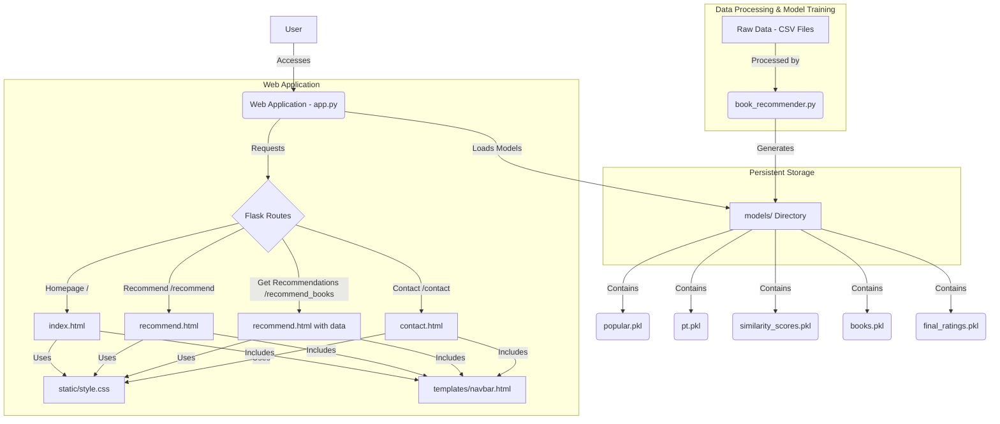

## Project Overview: Book Recommender System

The Book Recommender System is a Python-based web application built with the Flask framework. It provides users with book recommendations based on popularity and collaborative filtering. The project is structured into two main components: a data processing and model training script, and a Flask web application that serves the recommendations.

### 1. Data Processing and Model Training (`book_recommender.py`)

This script is responsible for preparing the dataset and generating the recommendation models.

*   **Data Ingestion:** Reads three CSV files: `Books.csv`, `Users.csv`, and `Ratings.csv`.
*   **Data Cleaning:**
    *   Handles missing values in `Book-Author`, `Publisher`, `Image-URL-L` (books data) and `Age` (users data).
    *   Identifies and reports duplicate entries.
*   **Popularity-Based Recommendation:**
    *   Calculates the number of ratings and average rating for each book.
    *   Identifies the top 50 books with at least 250 ratings, sorted by average rating.
*   **Collaborative Filtering Model:**
    *   Filters the dataset to include only users who have rated more than 200 books and books that have received at least 50 ratings.
    *   Constructs a pivot table (`pt`) where rows are book titles, columns are user IDs, and values are book ratings.
    *   Computes the `cosine_similarity` between books based on their rating patterns, forming the core of the recommendation engine.
*   **Model Persistence:** Serializes and saves the processed dataframes and the similarity matrix (`popular.pkl`, `pt.pkl`, `similarity_scores.pkl`, `books.pkl`, `final_ratings.pkl`) into the `models/` directory using Python's `pickle` module. These files are then loaded by the web application.

### 2. Web Application (`app.py`)

This Flask application serves as the user interface for the book recommender.

*   **Model Loading:** Loads the pre-trained models and data from the `models/` directory at startup.
*   **Routes:**
    *   `/`: The homepage, displaying the top 50 popular books.
    *   `/recommend`: A page featuring a search bar where users can input a book title to get recommendations.
    *   `/recommend_books` (POST): Processes the user's book input, uses the `similarity_scores` to find and display similar books.
    *   `/contact`: A simple contact information page.
*   **Templating:** Utilizes Jinja2 templates (`index.html`, `recommend.html`, `contact.html`, `navbar.html`) for dynamic content rendering.
*   **Styling:** Uses `static/style.css` for the application's visual presentation.

### Technology Stack

*   **Backend:** Python, Flask, Gunicorn (for production deployment)
*   **Data Science Libraries:** Pandas, NumPy, Scikit-learn
*   **Frontend:** HTML, CSS (Jinja2 templating)
*   **Deployment:** Procfile (for Heroku or similar platforms)

## Professional Project Diagram

